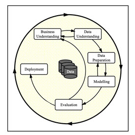
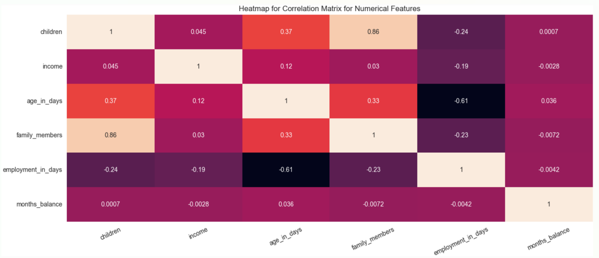
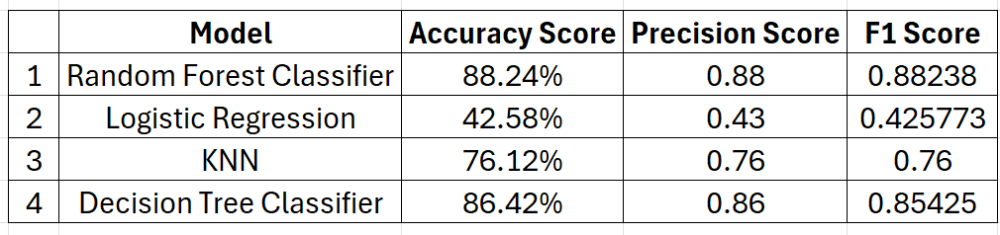

<h1 style="text-align: center; color: Purple;">Credit Card Approval - Will a client's credit card application be approved based on their credit-worthiness?</h1>

This Python application using Jupyter Notebook explores a dataset containing information of approximately 500,000 records in order to determine which factors make a potential client get their credit card application approved.

<a href="https://github.com/Balu-A/Capstone_Deliverable_1/blob/main/Balaji_Capstone_Deliverable1.ipynb" target="_blank">Jupiter Notebook used</a>

 The current CRISP-DM Process Model for Data Mining (see Figure 1) was followed.

<h4 align="center"> Figure 1</h4>

<h2>Business Understanding</h2>
From a business perspective, we are tasked with identifying key drivers for used car prices.  In the CRISP-DM overview, we are asked to convert this business framing to a data problem definition.  Using a few sentences, reframe the task as a data task with the appropriate technical vocabulary. 

<ol style="font-family: Arial;font-size: 16px;">
    <li style="color:Blue">  Tasks Involved: </li>
    <ul>
        <li style="color:Blue"> Develop a predictive modeling framework to determine whether a client's CC application is approved based on various demographic, social, and economic features.</li>
        <li style="color:Blue"> Perform exploratory data analysis to identify potential predictors of user subscription, such as Age, Gender, House/Car ownership, employment etc.,</li>
        <li style="color:Blue"> Construct a classification model that can quantify the impact of these features on the credit worthiness. Key tasks include feature selection, model training, and validation to ensure the model accurately captures the relationship between user attributes and their importance.</li>
        <li style="color:Blue"> Pinpoint the most influential factors affecting credit worthiness and provide actionable insights for marketing strategies.</li>
    </ul>
</ol>

<h2>Data Understanding</h2>
After considering the business understanding, we want to get familiar with our data.  Write down some steps that you would take to get to know the dataset and identify any quality issues within.  Take time to get to know the dataset and explore what information it contains and how this could be used to inform your business understanding.

 
<ol style="font-family: Arial;font-size: 16px;">
    <li style="color:Blue">  Data Exploration: </li>
    <ul>
        <li style="color:Blue"> Begin by examining the structure of the dataset. How many columns and rows does it contain?</li>
        <li style="color:Blue"> Print out the first few rows of the dataset to get a sense of what the data looks like.</li>
        <li style="color:Blue"> Check the data types of each column. Are they numerical, categorical, or date-time?</li>
        <li style="color:Blue"> Look for any missing values in the dataset. How prevalent are they, and how might they affect your analysis?</li>
    </ul>
    <li style="color:Blue">  Column Analysis: </li>
    <ul>
        <li style="color:Blue"> Examine the unique values in categorical columns. Are there any unexpected or invalid values?</li>
        <li style="color:Blue"> For numerical columns, check for outliers. Are there any values that seem unreasonable or far from the central tendency of the data?</li>
        <li style="color:Blue"> Check for consistency in date-time columns. Are all dates formatted correctly, and do they fall within expected ranges?</li>
    </ul>
    <li style="color:Blue">  Data Quality Assessment: </li>
    <ul>
        <li style="color:Blue"> Assess the completeness of the dataset. Are there any columns with a high proportion of missing values?</li>
        <li style="color:Blue"> Look for duplicates in the dataset. Are there any rows that are exact duplicates or nearly identical duplicates?</li>
    </ul>
    <li style="color:Blue">  Visualization: </li>
    <ul>
        <li style="color:Blue"> Create visualizations such as histograms, box plots, or scatter plots to explore the relationships between variables and identify any patterns or trends.</li>
        <li style="color:Blue"> Visualize missing data patterns to understand if there are any systematic issues with missing values.</li> 
    </ul> 

<h2>Data Preparation</h2>

1. A quick examination using DF.INFO yielded 
results that show that there is one column with nearly 30% of data that is null.  So, we are going to drop this column from modeling. 
   

<h4 align="center"> Figure 2</h4>

3. Upon inspection, there were **No duplicate rows** in the 
dataframe.

4. For better readability, I have renamed the original feature names to something more easier to read

5. Next up, a correlation heatmap was developed to understand the strength between dependent
and independent variables. Only numerical features were used for this.

<h4 align="center"> Figure 3</h4>

6. In order to build effective models, after performing feature selection using 
Sequential Feature Selection some of the low-importance features were **dropped** from the dataframe. The top 6 selected features are:

['Children', 'Income',
       'Age in Days', 'Family Members', 'Employment in Days', 'Months Balance']

<h2>Data Modeling </h2>

The prediction of output was made using various
set of independent variables/input variables using various classification models. The models used were: 

  
<strong>(a) Random Forest Classifier </strong>   
<strong>(b) Logistic Regression</strong>   
<strong>(c) K-Nearest Neighbors</strong>  
<strong>(d) Decision Trees</strong>

Out of the 4 models, the Random Forest Classifier model performed relatively better with 88% of Accuracy score. 
The nature of the data is such that the relationships between features and the target variable are non-linear or complex, making models like Random Forest and Decision Tree more suitable. Other models have achieved around 80% test accuracy, so the choice depends on 
the trade-off between training time and model complexity 

<h4 align="center"> Figure 4</h4>

<h2>Findings</h2>

(a) The<strong> most important drivers</strong> depicted by Sequential Feature Selector are: 

1.Children  
2. Income   
3. Age in Days  
4. Family Members  
5. Employment in Days  
6. Months Balance 

  

<h4 align="center"> Figure 5</h4>

 
 

<h4 align="center"> Figure 6</h4>

 

<h4 align="center"> Figure 7</h4>

 

<nobr>

<h2>Next Steps and Recommendations</h2>

- There are more females than males who have paid off their loan for that month and have no loan for the month. However, females have more overdue and bad debt than males
- There is a high likelihood of clients who own a house to have good credit. Therefore, marketing should target customers with housing loans. 
- As it is natural, clients who have a job tend to have good credit.  
- Develop targeted strategies to address customers with high-risk profiles, such as offering financial counseling or restructuring loan terms. 
- Segment customers based on their risk profiles. This can help in tailoring loan products and services to different customer groups, enhancing customer   satisfaction and reducing default rates.
